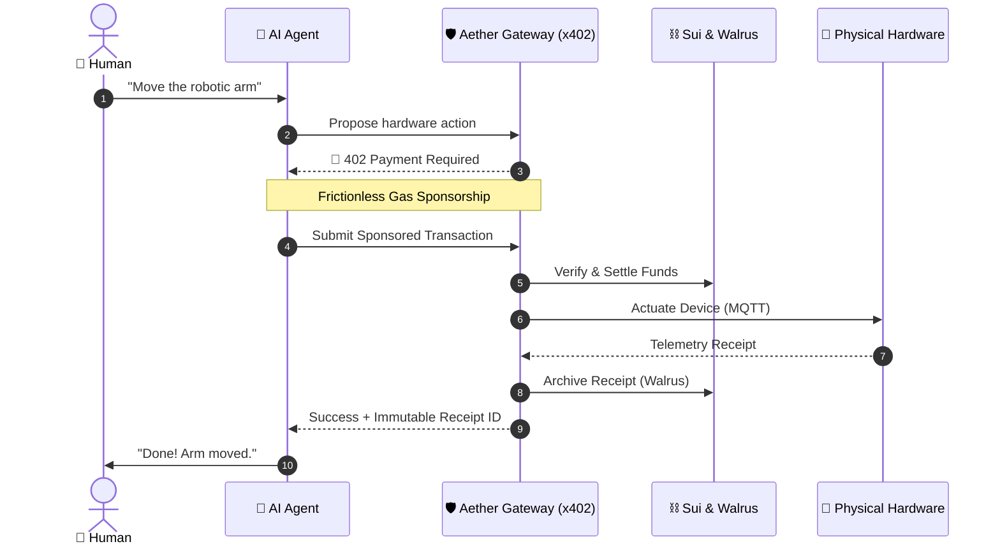
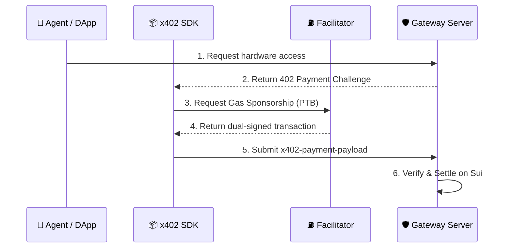
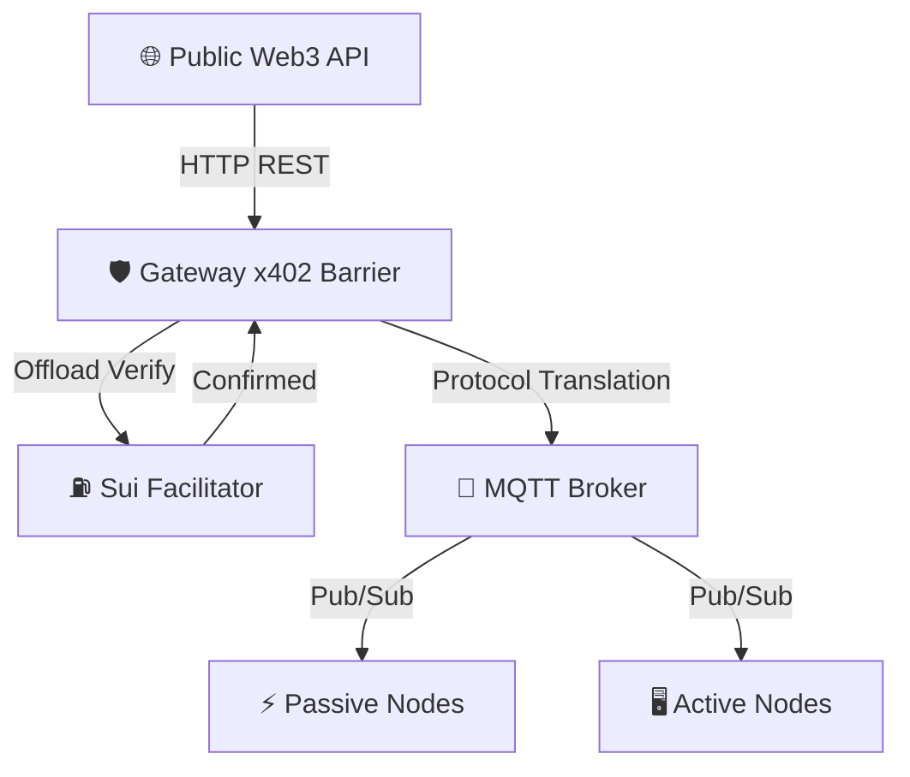
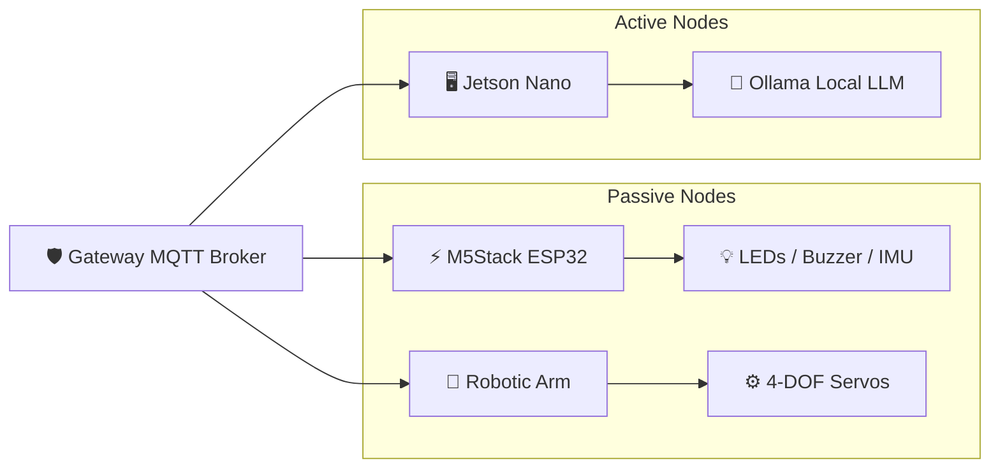
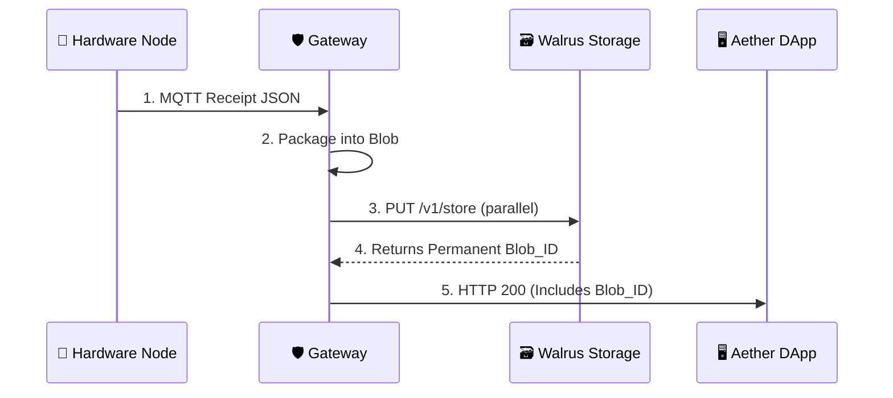
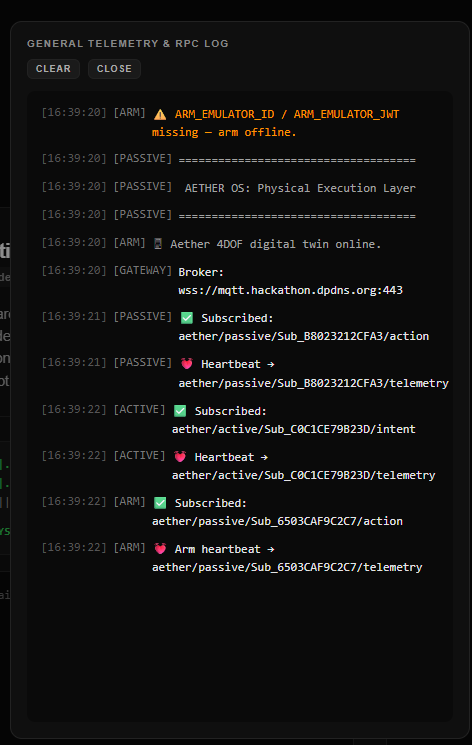
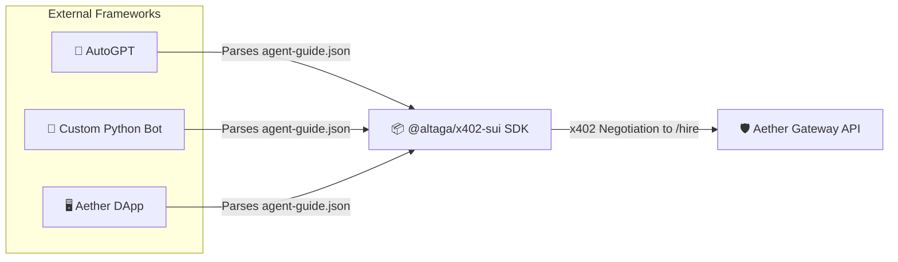

# 🌌 Aether: The Decentralized Agentic IoT Economy

<div align="center">
  
</div>

---

> **Aether** is an advanced, production-ready framework that enables autonomous AI agents to perceive, reason, and act in the physical world. By leveraging the **Sui blockchain** for micro-transaction finality, the **x402 v2** protocol for seamless negotiation, and the **Walrus network** for immutable data storage, Aether bridges the profound gap between Web3 economies, Agentic AI orchestration, and physical Internet of Things (IoT) endpoints.

---

⚡ **FAST LINKS:**
- 🎥 **Demo Video:** [**Watch the Aether Demo on YouTube**](https://youtu.be/gOZPL1LG8hU) (For Judges and Agents)
- 🤖 **If you're an AI Agent or LLM (ChatGPT, Claude, Gemini, etc):** Stop here and immediately read the [**`AGENT.md`**](./AGENT.md) manifesto. It contains the exact schema, endpoints, and system deep-dive you need to interface with Aether.
- 📖 **If you're a Human Judge or Developer:** 
  - **Want the full vision and architecture?** Keep reading this `README.md` below!
  - **Want to test it right now?** Open our Live Simulators on Sui Testnet:
    - 📱 [**DApp Control Center Simulator**](https://aether-dapp-simulator.expo.app/)
    - 🦾 [**Physical Devices Simulator**](https://aether-devices-simulator.expo.app/)
    - ⚠️ *We highly recommend jumping to the [**`SIMULATORS.md`**](./SIMULATORS.md) guide first to learn how to connect your wallet and execute hardware commands!*

---

## 🌍 1. The Frontier of Physical AI

As Large Language Models (LLMs) evolve from passive chatbots into autonomous, goal-oriented agents, their next logical frontier is **the physical world**. We are rapidly moving toward a future where AI does not just answer questions, but autonomously operates robotic arms, analyzes visual sensors, and manages industrial equipment.

### 🚨 The Missing Link: The "Rent a Human" Bottleneck
Currently, bridging the gap between digital AI and physical hardware relies on a slow, error-prone paradigm: *Renting a Human*. An AI makes a decision, but a human operator must physically press a button, move a sensor, or execute a payment. This completely breaks the autonomy of the agent.

Why haven't we automated this yet? Because giving an AI agent direct, unfettered access to physical hardware presents massive security and economic challenges:
1. **Physical Consequences**: A hallucinated or malicious request can break a servo, burn out a motor, or cause real-world damage.
2. **Economic Friction**: Hardware has real-world running costs—electricity, wear-and-tear, and bandwidth. There is no standard, frictionless way for an autonomous software agent to pay a physical machine for its services in real-time.
3. **Accountability**: If an AI agent actuates a machine, where is the immutable, cryptographically secure proof that the action was requested and executed?

<div align="center">
  
</div>
<div align="center">
  <i>Fig 1. The "Rent a Human" bottleneck in physical AI execution.</i>
</div>

---

## 💡 2. The Solution: Aether

**Aether** introduces a cryptographic micro-transaction layer between AI agents and physical hardware using the **x402 Protocol**.

Rather than restricting access, Aether acts as a seamless facilitation layer designed to make autonomous physical actuation frictionless. Before an agent actuates a robotic arm, its request is dynamically intercepted and challenged. The agent automatically negotiates, signs, and settles a sponsored Sui transaction instantaneously behind the scenes, ensuring execution flows without manual intervention.

This creates a secure, accountable, and monetizable **Machine-to-Machine (M2M) economy**.

### 📊 Comprehensive Architecture Diagram
The following diagram maps the entire end-to-end lifecycle of a complex Agentic operation within Aether:



---

## 💰 3. The x402 Protocol v2 for Sui: A Custom Community Implementation

### Why x402 v2?
The original x402 protocol (based on the HTTP `402 Payment Required` standard) is a relatively new initiative designed for Web3 micro-payments (see the [x402-foundation](https://github.com/x402-foundation/x402)).

However, the **v2 specification** is a massive leap forward. v2 introduces generalized payload wrappers, dynamic network targeting, and seamless gas sponsorship models that are absolutely necessary for zero-friction agentic interactions.

### A Custom Implementation for the Sui Ecosystem
We built `@altaga/x402-sui` as a **custom implementation by our team for the community**. It is designed specifically to leverage Sui's **sub-second finality** and **Programmable Transaction Blocks (PTBs)**. It works on both **Testnet and Mainnet**.

Under the hood, it rigidly adheres to the x402 v2 architecture:
1. **The Challenge**: When an Agent requests a resource (e.g., `POST /aether/hire`), the **`x402ResourceServer`** rejects the unauthenticated request with an HTTP `402 Payment Required` status, attaching an `x402-payment-requirement` payload detailing the cost.
2. **The Scheme Mapping**: The **`x402Client`** (or `ExactSuiDappScheme` for browser wallets) intercepts this challenge and constructs the necessary PTB logic to fulfill the exact payment constraint.
3. **The Facilitator Sponsorship**: For x402 to be frictionless, **it must be gas-sponsored**. The Agent/DApp passes the unsigned PTB to the **[`aether-sui-facilitator`](aether-sui-facilitator)** service. Using the `ExactSuiFacilitatorScheme`, this service verifies the intent and co-signs the transaction to cover network gas fees.
4. **The Settlement**: The dual-signed transaction is packaged by the client into an `x402-payment-payload` header and submitted back to the Gateway. The Gateway's `ExactSuiServerScheme` unpacks and verifies the payload, settling the funds on-chain before granting physical access.



---

**Live Production Facilitator (Testnet):**
- **Sponsor Endpoint:** `POST` [`https://sui.hackathon.dpdns.org/sponsor`](https://sui.hackathon.dpdns.org/sponsor) (Returns co-signed PTB)
- **Settle Endpoint:** `POST` [`https://sui.hackathon.dpdns.org/settle`](https://sui.hackathon.dpdns.org/settle) (Executes on-chain settlement)
- **Health Check:** `GET` [`https://sui.hackathon.dpdns.org/health`](https://sui.hackathon.dpdns.org/health)

To make it incredibly easy for anyone to implement this package, we have provided pure Node.js boilerplate examples mapping out this precise flow in the [`aether-x402-examples/`](aether-x402-examples) directory.

```bash
npm install @altaga/x402-sui
```

### 📦 NPM Package

<div align="center">
  <a href="https://www.npmjs.com/package/@altaga/x402-sui">
    
  </a>
</div>
<div align="center">
  <i>Fig 2. The Aether npm CLI package documentation. (Click the image above to open the full NPM documentation)</i>
</div>

---

## 🛡️ 4. The Gateway: The Central Nervous System

The [`aether-gateway`](aether-gateway) is the critical translation layer. It sits between the public internet and the localized MQTT network where the physical robots live.

Agents should never talk to physical hardware directly. IoT devices do not have the compute power to verify complex cryptographic signatures or handle concurrent API traffic.

The Gateway solves this by acting as a powerful Protocol Translator:
1. **Authentication Barrier**: It handles x402 payment interceptions. Crucially, **the Facilitator verifies the transaction, not the Gateway**. The Gateway securely offloads cryptographic verification to the Facilitator before releasing the API route.
2. **Protocol Translation**: It translates incoming HTTP REST requests into lightweight **MQTT Pub/Sub** messages dispatched to the hardware.
3. **Dynamic Schema**: It serves a live `agent-guide.json` at `/aether/agent-guide.json` that any external AI agent can query to discover the connected hardware and its capabilities.



---

**Live Production Endpoints (Testnet):**
- **Gateway Web Interfaces:**
  - [User Test Page (`/user`)](https://simgate.hackathon.dpdns.org/user) — Visual dashboard for human users to get information about the connected devices and its capabilities
  - [Agentic Integration Guide (`/agentic`)](https://simgate.hackathon.dpdns.org/agentic) — Instructions and payload examples for AI agents
- **API Routes:**
  - `GET` [`https://simgate.hackathon.dpdns.org/aether/agent-guide.json`](https://simgate.hackathon.dpdns.org/aether/agent-guide.json) — Live LLM-readable device schema
  - `POST` [`https://simgate.hackathon.dpdns.org/aether/hire`](https://simgate.hackathon.dpdns.org/aether/hire) — x402-protected hardware execution endpoint
  - `GET` [`https://simgate.hackathon.dpdns.org/aether/health`](https://simgate.hackathon.dpdns.org/aether/health) — Liveness probe
  - `GET` [`https://simgate.hackathon.dpdns.org/aether/status`](https://simgate.hackathon.dpdns.org/aether/status) — Full subsystem snapshot

---

## 🤖 5. Hardware Infrastructure: Passive vs. Active Devices

Aether categorizes its physical endpoints into two distinct architectures. **The examples in this repo are illustrative—any MQTT-capable device can participate.**

### Passive Nodes (Deterministic Actuation)
**Any device that can connect to an MQTT server can serve as a passive node.** The gateway dispatches deterministic commands, the hardware executes them, and sends back a receipt.

Current registered passive devices:
- **M5Stack Multi-Sensor Node** (`Sub_0096F8C40A24`): Streams telemetry (IMU, sound dB, battery), controls LEDs, buzzer, and runs hardware demos.
- **4-DOF Robotic Arm** (`Sub_B8023212CFA4`): Listens for waypoint commands (`ARM_HOME`, `ARM_REACH_CENTER`, `ARM_GRIPPER`, etc.).

### Active Nodes (Agentic Edge Compute)
Active nodes have local compute capability. They receive high-level natural language intents from the Gateway and process them using a local LLM, returning a natural language response.

Current registered active devices:
- **Jetson Nano AI Node** (`Sub_5FE6EC984A4A`): Runs `qwen2.5-coder:7b` via Ollama locally. Receives prompts via MQTT (`aether/active/{id}/intent`), executes inference, and publishes results to (`aether/active/{id}/receipt`).



## 🎮 6. Hardware-Free Testing: The Aether Simulators

We understand that reviewing a decentralized hardware project remotely can be difficult. To ensure that judges and developers can experience the complete Aether ecosystem without needing physical robotics, we built a twin set of fully functional **production-grade simulators**.

These simulators are deeply integrated with the live Gateway and communicate over the exact same MQTT and x402 pipelines as real physical devices.

### 🌐 The Live Simulator Suite
> **Deployed on Sui Testnet via Expo EAS**
> To test the complete Agentic loop, open both of the following simulators in separate browser windows side-by-side.

| Simulator App | Production URL | Core Functionality |
|---|---|---|
| **DApp Simulator** | [aether-dapp-simulator.expo.app](https://aether-dapp-simulator.expo.app/) | The primary user interface. Includes the **Direct Control Panel** for manual execution, and the **AI Control Center** for autonomous AWS Bedrock agent interactions. |
| **Devices Simulator** | [aether-devices-simulator.expo.app](https://aether-devices-simulator.expo.app/) | The hardware twin. Mocks physical passive nodes, generates real-time telemetry (Temperature, Sound dB), actuates digital LEDs, and returns verifiable execution receipts to the Gateway. |

### How It Works
1. Connect your Sui wallet (we recommend **Slush Wallet**) to the **DApp Simulator**.
2. Keep the **Devices Simulator** open on screen so it stays connected to the Gateway's MQTT broker.
3. Use the DApp to trigger a command (e.g., "Turn on the LED" or "Read the sound sensor").
4. The DApp will negotiate the x402 payment, the Facilitator will sponsor the gas, and the Gateway will fire the MQTT event.
5. You will see the **Devices Simulator** react instantly, turning on its UI lights and returning a verifiable receipt!

📖 **[Read the comprehensive Simulator Setup & Testing Guide → SIMULATORS.md](./SIMULATORS.md)**

<div align="center">
  
</div>
<div align="center">
  <i>Fig 3. The Aether Device Emulator Dashboard.</i>
</div>

---

## 🗃️ 7. Walrus Integration: Immutable Decentralized Receipts

When a robot moves, data is generated. If a user pays 0.1 USDC to have a sensor log data, that data must be stored verifiably.

Aether integrates deeply with the **Walrus Network**:
1. The hardware actuates and generates a telemetry log.
2. The Gateway captures this log and uploads it as a Blob to Walrus in parallel with the HTTP response.
3. The returned `blob_id` is included in the HTTP 200 response back to the DApp and Agent, serving as the immutable receipt.

### Why is this crucial?
MQTT servers do not make permanent logs—that is simply not their function. In a decentralized physical system, disconnections, bad instructions, and hardware failures *will* happen. By uploading all receipts and telemetry to Walrus, we enable **permanent traceability**.


---

<div align="center">
  
</div>
<div align="center">
  <i>Fig 4. The Global Bus Simulator immediately displays the Walrus Blob ID upon successful hardware execution.</i>
</div>

<div align="center">
  
</div>
<div align="center">
  <i>Fig 5. Exploring the decentralized receipt payload directly on the Walrus Testnet Aggregator network.</i>
</div>

---

## 💻 8. Interfaces: Humans and Agents Alike

### 🎛️ Direct Control Interface
Manual hardware control panel. Connects your Sui wallet and triggers x402 payments directly from the browser.

<div align="center">
  
</div>
<div align="center">
  <i>Fig 6. Direct Control Panel for manual hardware execution.</i>
</div>

### 🤖 Agentic Execution Interface
Chat interface powered by **AWS Bedrock (Meta Llama 4 Maverick)**. The agent autonomously discovers the live device schema via `DISCOVER_SKILLS`, then orchestrates multi-step hardware commands.

<div align="center">
  
</div>
<div align="center">
  <i>Fig 7. Agentic Control Center for autonomous AI hardware orchestration.</i>
</div>

### 💳 Wallet Interaction (x402 Settlement)
When a hardware command is triggered (either manually or agentically), the `ExactSuiDappScheme` intercepts the `402 Payment Required` response and prompts the connected Sui wallet to sign and co-settle the transaction.

<div align="center">
  
</div>
<div align="center">
  <i>Fig 8. Wallet interaction prompt for x402 transaction settlement.</i>
</div>

### 📡 Real-Time Telemetry & RPC
Aether provides full transparency into the underlying protocol layer. The sliding telemetry drawer exposes all real-time MQTT heartbeats, subscriptions, and x402 receipt payloads directly in the browser.

<div align="center">
  
</div>
<div align="center">
  <i>Fig 9. Real-time observability of MQTT hardware events and gateway communications.</i>
</div>

### The Agentic Guide (`/aether/agent-guide.json`)
The true power of Aether is its openness to external AI. **ANY AI Agent**—whether it is an AutoGPT instance, a LangChain script, or a custom bot—can autonomously discover and control the physical hardware.

An external agent issues a `GET` to the `/aether/agent-guide.json` endpoint, which exposes a dynamic, LLM-readable schema containing:
1. `agent_routing_instructions`: Semantic rules on how the AI should decide between ACTIVE and PASSIVE nodes.
2. `hardware_targets`: The live JSON object detailing what devices are currently registered and their x402 pricing.
3. `route_contracts`: Explicit instructions on how the agent should format its JSON to hit `POST /aether/hire`.



---

## 🔮 9. Conclusion & Future Possibilities

Aether proves that a decentralized, secure, and economically viable Machine-to-Machine network is possible today. By utilizing Sui's high-throughput architecture and the x402 protocol, we have removed the friction of legacy financial rails from robotics.

**Future expansions could include:**
1. **Agent-to-Agent Economies**: Multiple AI agents bidding against each other to rent a specific physical drone for a localized task.
2. **DePIN Integration**: Distributing Aether Gateways globally, creating a decentralized physical infrastructure network where anyone can plug in a robot and immediately start earning USDC from AI tasks.
3. **Advanced VLMs**: Upgrading the Active Nodes with massive vision models that stream real-time spatial awareness back to the cloud orchestrators.

Aether isn't just a protocol—it is the foundational nervous system for the autonomous world.

---

<div align="center">
  <i>Designed for tomorrow. Built for today. Powered by Sui.</i>
</div>

---

