# 🌌 Aether: The Decentralized Agentic IoT Economy

<div align="center">
  
</div>

---

> **Aether** is an advanced, production-ready framework that enables autonomous AI agents to perceive, reason, and act in the physical world. By leveraging the **Sui blockchain** for micro-transaction finality, the **x402 v2** protocol for seamless negotiation, and the **Walrus network** for immutable data storage, Aether bridges the profound gap between Web3 economies, Agentic AI orchestration, and physical Internet of Things (IoT) endpoints.

---

## 📖 1. The Vision and The Problem

### 🚨 The Problem: "Rent a Human" is Not Scalable
As Large Language Models (LLMs) evolve from passive chatbots into autonomous, goal-oriented agents, their next logical frontier is the physical world. We want AI that can not only answer questions but can also operate robotic arms, check visual sensors, or manage industrial equipment.

Currently, to get an AI to do something physical, the paradigm is essentially "Rent a Human." The AI makes a decision, outputs a suggestion, and a human operator is paid to physically press a button, move a sensor, or operate a machine. This is slow, error-prone, and breaks the autonomy of the agent.

However, giving an AI agent direct access to physical hardware presents catastrophic security and economic challenges:
1. **Physical Consequences**: A bad physical request can break a servo or burn out a motor.
2. **Economic Friction**: Hardware has real-world running costs—electricity, wear-and-tear, and bandwidth. There is currently no standard, frictionless way for an autonomous software agent to pay a physical machine for its services in real-time.
3. **Accountability**: If an AI agent actuates a machine, where is the immutable proof that the action was requested and executed?


---

## 💡 2. The Solution: Aether

**Aether** introduces a cryptographic micro-transaction layer between AI agents and physical hardware using the **x402 Protocol**.

Rather than restricting access, Aether acts as a seamless facilitation layer designed to make autonomous physical actuation frictionless. Before an agent actuates a robotic arm, its request is dynamically intercepted and challenged. The agent automatically negotiates, signs, and settles a sponsored Sui transaction instantaneously behind the scenes, ensuring execution flows without manual intervention.

This creates a secure, accountable, and monetizable **Machine-to-Machine (M2M) economy**.

### 📊 Comprehensive Architecture Diagram
The following diagram maps the entire end-to-end lifecycle of a complex Agentic operation within Aether:

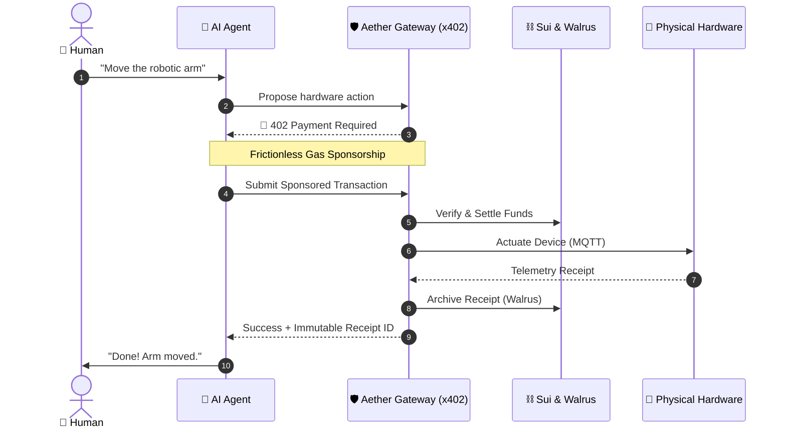

---

## 💰 3. The x402 Protocol v2 for Sui: A Custom Community Implementation

### Why x402 v2?
The original x402 protocol (based on the HTTP `402 Payment Required` standard) is a relatively new initiative designed for Web3 micro-payments (see the [x402-foundation](https://github.com/x402-foundation/x402)).

However, the **v2 specification** is a massive leap forward. v2 introduces generalized payload wrappers, dynamic network targeting, and seamless gas sponsorship models that are absolutely necessary for zero-friction agentic interactions.

### A Custom Implementation for the Sui Ecosystem
We built `@altaga/x402-sui` as a **custom implementation by our team for the community**. It is designed specifically to leverage Sui's **sub-second finality** and **Programmable Transaction Blocks (PTBs)**. It works on both **Testnet and Mainnet**.

Under the hood, it rigidly adheres to the x402 v2 architecture:
1. **The Challenge**: When an Agent requests a resource (e.g., `POST /aether/hire`), the **`x402ResourceServer`** rejects the unauthenticated request with an HTTP `402 Payment Required` status, attaching an `x402-payment-requirement` payload detailing the cost.
2. **The Scheme Mapping**: The **`x402Client`** (or `ExactSuiDappScheme` for browser wallets) intercepts this challenge and constructs the necessary PTB logic to fulfill the exact payment constraint.
3. **The Facilitator Sponsorship**: For x402 to be frictionless, **it must be gas-sponsored**. The Agent/DApp passes the unsigned PTB to the **`aether-sui-facilitator`** service. Using the `ExactSuiFacilitatorScheme`, this service verifies the intent and co-signs the transaction to cover network gas fees.
4. **The Settlement**: The dual-signed transaction is packaged by the client into an `x402-payment-payload` header and submitted back to the Gateway. The Gateway's `ExactSuiServerScheme` unpacks and verifies the payload, settling the funds on-chain before granting physical access.

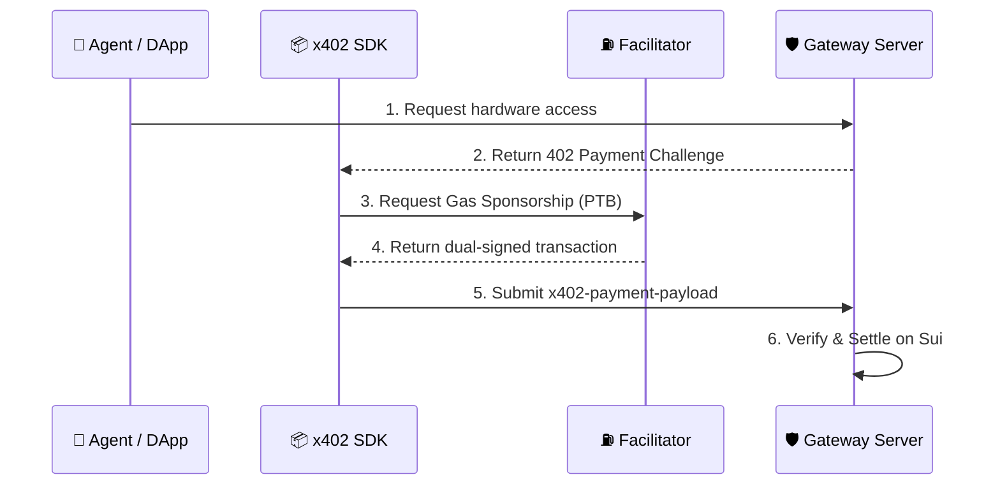

---

**Live Production Facilitator (Testnet):**
- **Sponsor Endpoint:** `POST https://sui.hackathon.dpdns.org/sponsor` (Returns co-signed PTB)
- **Settle Endpoint:** `POST https://sui.hackathon.dpdns.org/settle` (Executes on-chain settlement)
- **Health Check:** `GET` [`https://sui.hackathon.dpdns.org/health`](https://sui.hackathon.dpdns.org/health)

To make it incredibly easy for anyone to implement this package, we have provided pure Node.js boilerplate examples mapping out this precise flow in the `aether-x402-examples/` directory.

```bash
npm install @altaga/x402-sui
```

### 📦 NPM Package

[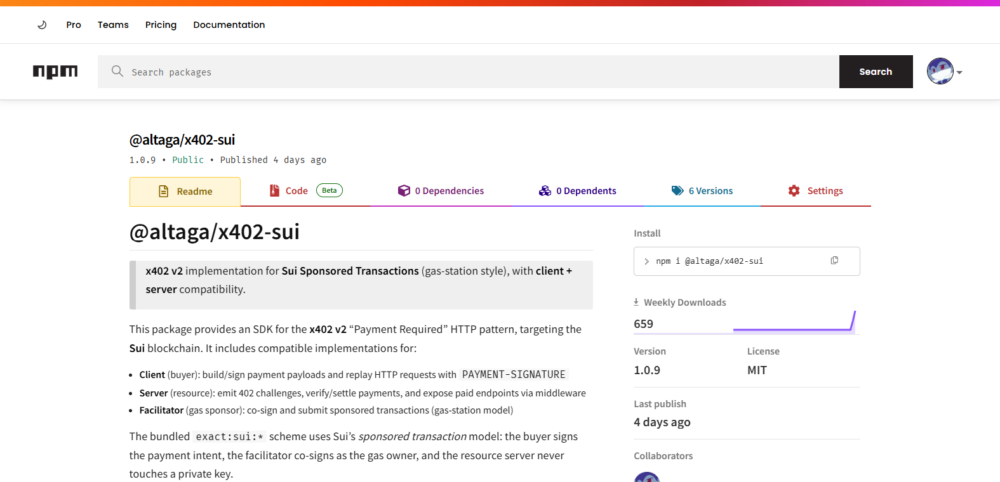](https://www.npmjs.com/package/@altaga/x402-sui)
*(Click the image above to open the full NPM documentation)*

---

## 🛡️ 4. The Gateway: The Central Nervous System

The `aether-gateway` is the critical translation layer. It sits between the public internet and the localized MQTT network where the physical robots live.

Agents should never talk to physical hardware directly. IoT devices do not have the compute power to verify complex cryptographic signatures or handle concurrent API traffic.

The Gateway solves this by acting as a powerful Protocol Translator:
1. **Authentication Barrier**: It handles x402 payment interceptions. Crucially, **the Facilitator verifies the transaction, not the Gateway**. The Gateway securely offloads cryptographic verification to the Facilitator before releasing the API route.
2. **Protocol Translation**: It translates incoming HTTP REST requests into lightweight **MQTT Pub/Sub** messages dispatched to the hardware.
3. **Dynamic Schema**: It serves a live `agent-guide.json` at `/aether/agent-guide.json` that any external AI agent can query to discover the connected hardware and its capabilities.

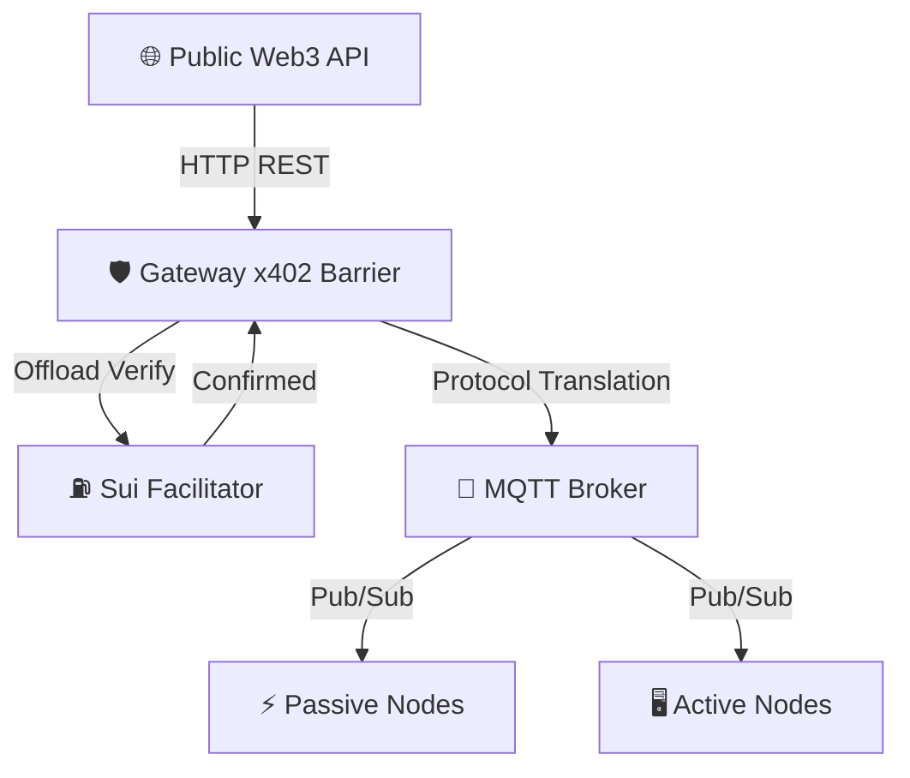

---

**Live Production Endpoints (Testnet):**
- **Gateway Web Interfaces:**
  - [User Test Page (`/user`)](https://simgate.hackathon.dpdns.org/user) — Visual dashboard for human users to get information about the connected devices and its capabilities
  - [Agentic Integration Guide (`/agentic`)](https://simgate.hackathon.dpdns.org/agentic) — Instructions and payload examples for AI agents
- **API Routes:**
  - `GET` [`https://simgate.hackathon.dpdns.org/aether/agent-guide.json`](https://simgate.hackathon.dpdns.org/aether/agent-guide.json) — Live LLM-readable device schema
  - `POST https://simgate.hackathon.dpdns.org/aether/hire` — x402-protected hardware execution endpoint
  - `GET` [`https://simgate.hackathon.dpdns.org/aether/health`](https://simgate.hackathon.dpdns.org/aether/health) — Liveness probe
  - `GET` [`https://simgate.hackathon.dpdns.org/aether/status`](https://simgate.hackathon.dpdns.org/aether/status) — Full subsystem snapshot

---

## 🤖 5. Hardware Infrastructure: Passive vs. Active Devices

Aether categorizes its physical endpoints into two distinct architectures. **The examples in this repo are illustrative—any MQTT-capable device can participate.**

### Passive Nodes (Deterministic Actuation)
**Any device that can connect to an MQTT server can serve as a passive node.** The gateway dispatches deterministic commands, the hardware executes them, and sends back a receipt.

Current registered passive devices:
- **M5Stack Multi-Sensor Node** (`Sub_0096F8C40A24`): Streams telemetry (IMU, sound dB, battery), controls LEDs, buzzer, and runs hardware demos.
- **4-DOF Robotic Arm** (`Sub_B8023212CFA4`): Listens for waypoint commands (`ARM_HOME`, `ARM_REACH_CENTER`, `ARM_GRIPPER`, etc.).

### Active Nodes (Agentic Edge Compute)
Active nodes have local compute capability. They receive high-level natural language intents from the Gateway and process them using a local LLM, returning a natural language response.

Current registered active devices:
- **Jetson Nano AI Node** (`Sub_5FE6EC984A4A`): Runs `qwen2.5-coder:7b` via Ollama locally. Receives prompts via MQTT (`aether/active/{id}/intent`), executes inference, and publishes results to (`aether/active/{id}/receipt`).

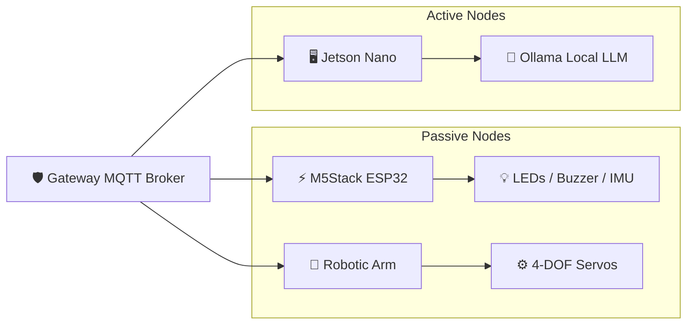

### 🎮 Device Simulator (For Hardware-Free Testing)
For judges and developers testing Aether without physical hardware, we provide a fully functional **Device Simulator** that mocks the passive node endpoints, generating real-time telemetry (temperature, sound dB, LEDs) and responding to MQTT commands identically to real edge devices.

### 🌐 Live Simulators
> **Both simulators are Expo applications deployed via EAS on Sui Testnet.**
> Open both tabs simultaneously to test the full Agentic loop without any physical hardware.

| Simulator | URL | Role |
|---|---|---|
| **DApp Simulator** | [aether-dapp-simulator.expo.app](https://aether-dapp-simulator.expo.app/) | AI Control Center — Direct Control + Agent chat |
| **Devices Simulator** | [aether-devices-simulator.expo.app](https://aether-devices-simulator.expo.app/) | Hardware Emulator — receives MQTT commands, returns receipts |

📖 **[Read the full simulator usage guide → SIMULATORS.md](./SIMULATORS.md)**

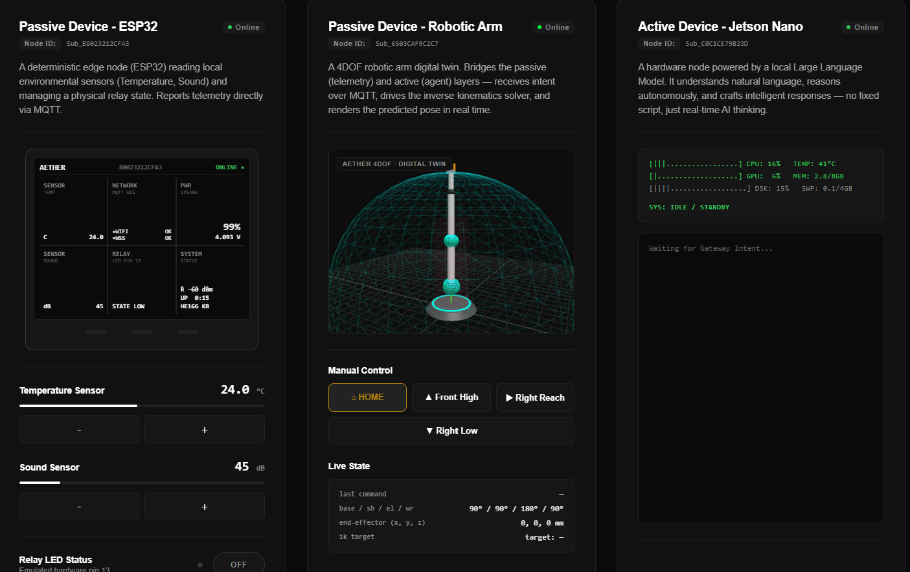

---

## 🗃️ 6. Walrus Integration: Immutable Decentralized Receipts

When a robot moves, data is generated. If a user pays 0.1 USDC to have a sensor log data, that data must be stored verifiably.

Aether integrates deeply with the **Walrus Network**:
1. The hardware actuates and generates a telemetry log.
2. The Gateway captures this log and uploads it as a Blob to Walrus in parallel with the HTTP response.
3. The returned `blob_id` is included in the HTTP 200 response back to the DApp and Agent, serving as the immutable receipt.

### Why is this crucial?
MQTT servers do not make permanent logs—that is simply not their function. In a decentralized physical system, disconnections, bad instructions, and hardware failures *will* happen. By uploading all receipts and telemetry to Walrus, we enable **permanent traceability**.

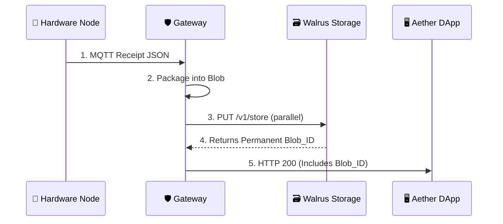

---

## 💻 7. Interfaces: Humans and Agents Alike

### 🎛️ Direct Control Interface
Manual hardware control panel. Connects your Sui wallet and triggers x402 payments directly from the browser.

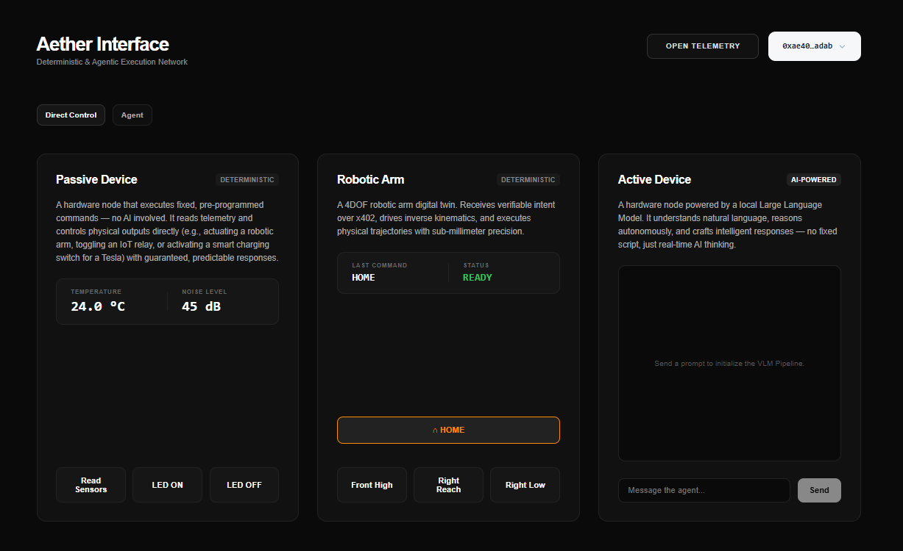

### 🤖 Agentic Execution Interface
Chat interface powered by **AWS Bedrock (Meta Llama 4 Maverick)**. The agent autonomously discovers the live device schema via `DISCOVER_SKILLS`, then orchestrates multi-step hardware commands.

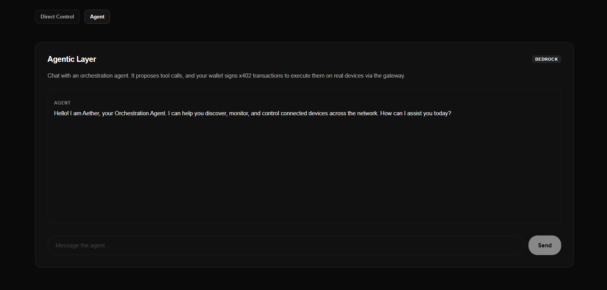

### 💳 Wallet Interaction (x402 Settlement)
When a hardware command is triggered (either manually or agentically), the `ExactSuiDappScheme` intercepts the `402 Payment Required` response and prompts the connected Sui wallet to sign and co-settle the transaction.

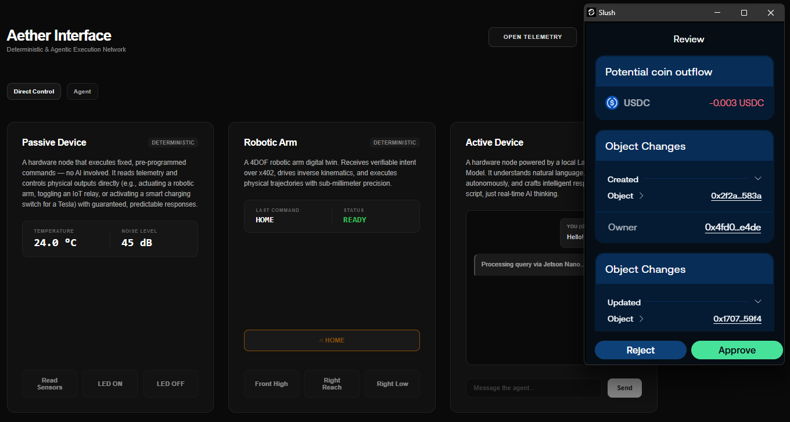

### The Agentic Guide (`/aether/agent-guide.json`)
The true power of Aether is its openness to external AI. **ANY AI Agent**—whether it is an AutoGPT instance, a LangChain script, or a custom bot—can autonomously discover and control the physical hardware.

An external agent issues a `GET` to the `/aether/agent-guide.json` endpoint, which exposes a dynamic, LLM-readable schema containing:
1. `agent_routing_instructions`: Semantic rules on how the AI should decide between ACTIVE and PASSIVE nodes.
2. `hardware_targets`: The live JSON object detailing what devices are currently registered and their x402 pricing.
3. `route_contracts`: Explicit instructions on how the agent should format its JSON to hit `POST /aether/hire`.

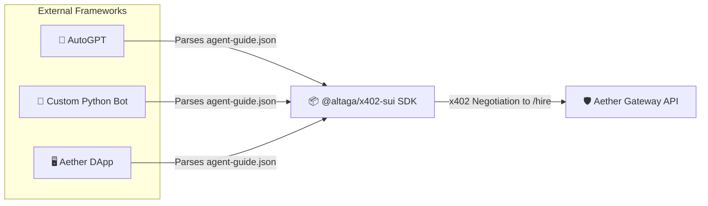

---

## 🔮 8. Conclusion & Future Possibilities

Aether proves that a decentralized, secure, and economically viable Machine-to-Machine network is possible today. By utilizing Sui's high-throughput architecture and the x402 protocol, we have removed the friction of legacy financial rails from robotics.

**Future expansions could include:**
1. **Agent-to-Agent Economies**: Multiple AI agents bidding against each other to rent a specific physical drone for a localized task.
2. **DePIN Integration**: Distributing Aether Gateways globally, creating a decentralized physical infrastructure network where anyone can plug in a robot and immediately start earning USDC from AI tasks.
3. **Advanced VLMs**: Upgrading the Active Nodes with massive vision models that stream real-time spatial awareness back to the cloud orchestrators.

Aether isn't just a protocol—it is the foundational nervous system for the autonomous world.

---

<div align="center">
  <i>Designed for tomorrow. Built for today. Powered by Sui.</i>
</div>

---

## 🗂️ Appendix: System Deep Dive (Module & File Breakdown)

For AI agents and judges reviewing the architecture, here is a precise breakdown of every major module and its critical files. Note that all **simulator packages** (`*-simulator`) are excluded from the public repo per `.gitignore` and run as independent Expo deployments.

### A. `@altaga/x402-sui` (The Core Protocol SDK)
This is the foundational package that implements the x402 standard specifically for the Sui blockchain. It handles all the heavy lifting for PTB creation, gas sponsorship, and on-chain settlement.

**Full API documentation:** [npmjs.com/package/@altaga/x402-sui](https://www.npmjs.com/package/@altaga/x402-sui)

```bash
npm install @altaga/x402-sui
```

**Key Exports:**
- **`x402ResourceServer`**: Generates the `402 Payment Required` challenge payloads on the Gateway.
- **`x402Client`** / **`x402HTTPClient`**: Interprets 402 challenges and constructs PTB logic for Node.js agents.
- **`ExactSuiDappScheme`**: Browser-side scheme — integrates with connected Sui wallets (e.g., Suiet, Slush) to sign PTBs directly.
- **`x402Facilitator`** / **`ExactSuiFacilitatorScheme`**: Gas-sponsorship logic for the Facilitator service to dual-sign PTBs.
- **`ExactSuiServerScheme`**: Server-side verifier that unpacks and settles the signed payload on-chain.

---

### B. `aether-gateway` (The x402 Barrier & Router)
Node.js + Express service. The x402 enforcement layer and MQTT protocol bridge.

- **`src/index.js`**: Main entry point. Boots the HTTP server, MQTT broker, Walrus publisher, and Sui event listener.
- **`src/app.js`**: Express app factory — registers all x402 routes.
- **`src/services/settings/settings.js`**: Loads and validates `config/devices.json` at startup.
- **`src/services/x402/routes.js`**: Exposes `POST /aether/hire` (x402 barrier) and `GET /aether/agent-guide.json` (dynamic schema).
- **`src/services/dispatch/dispatcher.js`**: Execution engine — publishes MQTT commands and waits for hardware receipts with timeout handling.
- **`src/services/mqtt/broker.js`**: Manages the MQTT WebSocket connection and inbound telemetry routing.
- **`src/services/walrus/publisher.js`**: Uploads MQTT receipts to Walrus in parallel with HTTP responses.
- **`src/services/sui/listener.js`**: Listens to on-chain Sui events and dispatches MQTT commands from blockchain triggers.
- **`config/devices.json`**: Zero-config device registry. Add a new device here and it is immediately available via `agent-guide.json`.

---

### C. `aether-dapp` (The Production Orchestrator UI)
Expo (React Native Web) application deployed via EAS. Connects a Sui wallet and orchestrates the full Agentic loop on **Mainnet**.

- **`src/app/api/agent+api.ts`**: AWS Bedrock (Meta Llama 4 Maverick) LLM orchestration loop. Implements `DISCOVER_SKILLS` dynamic schema injection and multi-turn tool call resolution.
- **`src/app/index.tsx`**: Main UI. Renders the Direct Control tab and the Agentic chat interface. Integrates `ExactSuiDappScheme` for browser wallet x402 signing.
- **`src/app/_layout.tsx`**: Provider setup — `SuiClientProvider` (Mainnet), `WalletProvider`, `QueryClientProvider`.

---

### D. `aether-sui-facilitator` (The Gas Station)
Minimal Node.js + Express microservice. Acts as the gas station for sponsored Sui transactions on **Mainnet**.

- **`index.mjs`**: Exposes three endpoints:
  - `POST /sponsor` — Builds and co-signs the PTB with the facilitator keypair.
  - `POST /verify` — Validates a submitted payment payload.
  - `POST /settle` — Executes the final on-chain settlement.

Setup:
```bash
cd aether-sui-facilitator
npm install
cp .env.example .env   # Set FACILITATOR_PRIVATE_KEY
npm start
# Runs on port 8085 by default
```

---

### E. `aether-devices` (The Physical Edge)

#### Passive Node (`aether-passive-node/`)
Arduino/C++ firmware for M5Stack or ESP32 devices.

- **`Aether_Passive_Node.ino`**: Main sketch. Connects to MQTT and routes incoming commands to hardware actuators.
- **`MQTTManager.h`**: Handles MQTT connection, authentication (JWT), subscription, and reconnection logic.
- **`AetherNode.h`**: Command router — maps MQTT command strings to physical hardware actions (LEDs, buzzer, IMU reads, etc.).
- **`AetherOS.h`**: Device operating system abstraction — hardware initialization and pin management.
- **`creds.h`**: WiFi and MQTT credentials (**excluded from repo** via `.gitignore`).

#### Active Node (`aether-active-node/`)
Node.js daemon for Jetson Nano or any Linux device with a local Ollama instance.

- **`index.js`**: Connects to MQTT, subscribes to `aether/active/{DEVICE_ID}/intent`, forwards prompts to local Ollama (`qwen2.5-coder:7b`), and publishes results to `aether/active/{DEVICE_ID}/receipt`.

Setup:
```bash
cd aether-devices/aether-active-node
npm install
cp .env.example .env   # Set MQTT_BROKER_URL, MQTT_BROKER_JWT, DEVICE_ID
node index.js
# Requires Ollama running locally with qwen2.5-coder:7b pulled
```

---

### F. `aether-ws` (MQTT WebSocket Broker)
A custom WebSocket-to-MQTT bridge built with `ws` and `mqtt-packet`. Acts as the lightweight MQTT broker layer for the gateway when running locally, supporting JWT-authenticated client connections.

- **`index.js`**: Main broker — validates JWT tokens, routes MQTT packets between clients, and manages pub/sub state.

---

### G. `aether-x402-examples` (Standalone Node.js Testing)
Pure Node.js boilerplate scripts for testing the x402 payment flow without any UI or Expo dependency.

- **`Buyer/index.mjs`**: Simulates an Agent (`x402HTTPClient`) hitting an x402-protected seller endpoint. Reads `BUYER_SECRET` from `.env`.
- **`Facilitator/index.mjs`**: Runs a local Facilitator Gas Station on port `8085`. Reads `FACILITATOR_PRIVATE_KEY` from `.env`.
- **`Seller/index.mjs`**: Runs a minimal x402-protected Express server on port `4021` that returns `premium-data` after a verified payment.

Setup:
```bash
cd aether-x402-examples
npm install
# Create Buyer/.env and Facilitator/.env from their respective .env.example files
# Run each service in a separate terminal:
node Facilitator/index.mjs   # Terminal 1
node Seller/index.mjs        # Terminal 2
node Buyer/index.mjs         # Terminal 3
```

---

## 🌐 Live Production Infrastructure

All Testnet services are **deployed and live**. Open these URLs directly in your browser to inspect the running system.

### 🛡️ Simulator Gateway — `simgate.hackathon.dpdns.org`

| Endpoint | Link | Returns |
|---|---|---|
| Health | [/aether/health](https://simgate.hackathon.dpdns.org/aether/health) | `{ok, gateway_address, uptime}` |
| Status | [/aether/status](https://simgate.hackathon.dpdns.org/aether/status) | Broker state, supervised device count, in-flight requests |
| Agent Guide | [/aether/agent-guide.json](https://simgate.hackathon.dpdns.org/aether/agent-guide.json) | Full live LLM-readable device schema (hardware targets, commands, pricing) |

### ⛽ Sui Facilitator — `sui.hackathon.dpdns.org`

| Endpoint | Link | Returns |
|---|---|---|
| Health | [/health](https://sui.hackathon.dpdns.org/health) | `{"status":"ok"}` |
| Sponsor | `POST /sponsor` | Co-signed PTB (called automatically by DApp) |
| Settle | `POST /settle` | On-chain Testnet settlement (called automatically by DApp) |

📖 **[Full endpoint documentation with example responses → SIMULATORS.md](./SIMULATORS.md)**