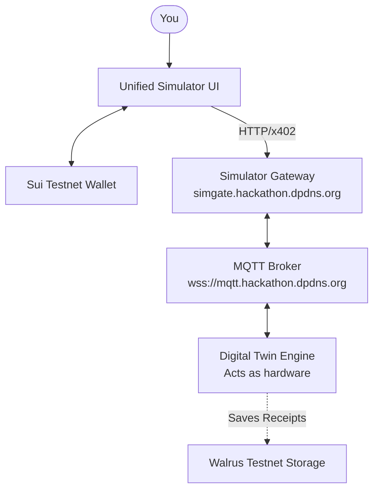
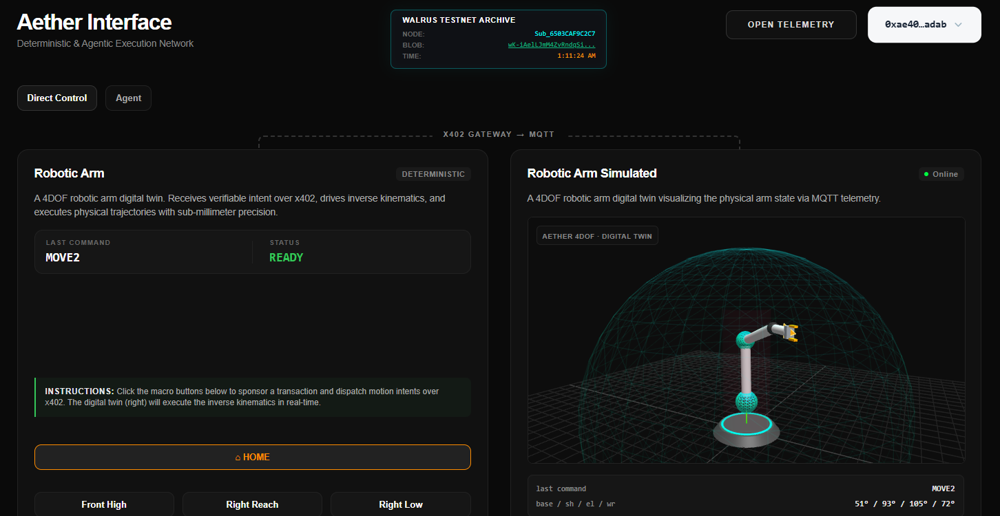
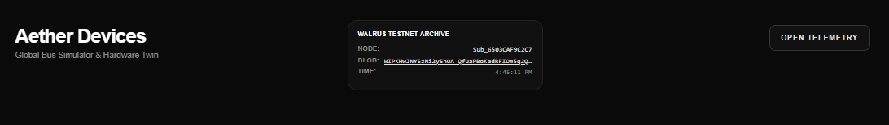
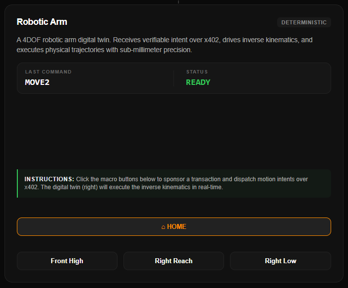
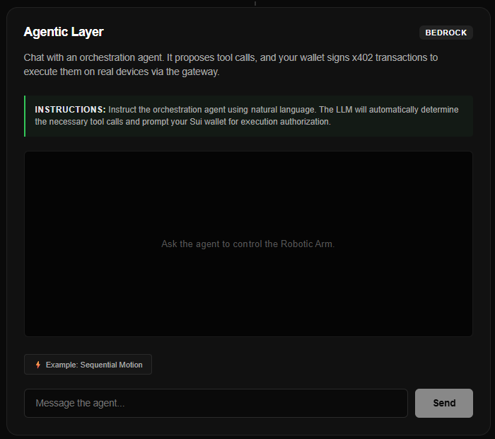
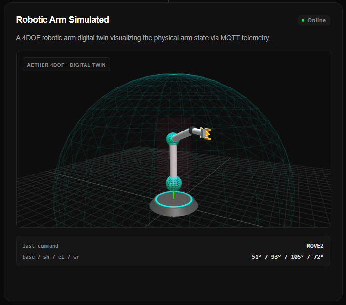
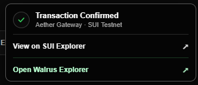
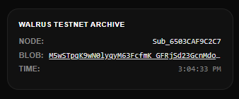
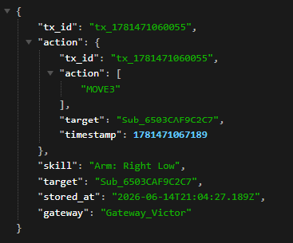

# Aether Simulator — Usage Guide

<div align="center">
  
</div>

---

> [!IMPORTANT]
> **ALL PRODUCTION SYSTEMS ARE ON SUI MAINNET.** The physical Aether hardware, production DApp, and [YouTube demo](https://youtu.be/gOZPL1LG8hU) all run live on Mainnet. This guide walks you through the **production-grade Aether simulator** deployed on **Sui Testnet** — no physical hardware required, but it faithfully replicates the full Agentic IoT economy loop.

---

## Quick Start

| Step | Action |
|---|---|
| 1 | Open the **[Aether Simulator](https://aether-dapp-simulator.expo.app/)** |
| 2 | Install **[Slush Wallet](https://slush.app/)** (Chrome extension) |
| 3 | Switch wallet network to **Testnet** |
| 4 | Get free Testnet SUI + USDC (faucet links below) |
| 5 | Connect your wallet in the Simulator and trigger a command |

---

## How It Works



The **Digital Twin Engine** connects to the same MQTT broker as real hardware. When the DApp triggers a command, the Twin receives it, animates its 3D visualization, and returns a receipt — exactly as a physical device would.

---

## Setup

### 1. Install a Sui Wallet

**Recommended wallets:**
- [Slush Wallet](https://slush.app/) — Chrome — **Recommended**
- [Suiet Wallet](https://suiet.app/) — Chrome/Firefox
- [Sui Wallet (official)](https://chrome.google.com/webstore/detail/sui-wallet/opcgpfmipidbgpenhmajoajpbobppdil) — Chrome

> [!NOTE]
> After installing, create a new wallet and write down your seed phrase.

### 2. Switch to Testnet

In your wallet extension: open Settings → Network → select **Testnet**.

### 3. Get Testnet SUI (Gas)

Visit [faucet.testnet.sui.io](https://faucet.testnet.sui.io/) or use the `#devnet-faucet` channel in the [Sui Discord](https://discord.gg/sui).

### 4. Get Testnet USDC

Aether uses **Testnet USDC** as the payment token. Token address:
```
0xdba34672e30cb065b1f93e3ab55318768fd6fef66c15942c9f7cb846e2f900e7::usdc::USDC
```
Get USDC via the [Sui Testnet Faucet](https://faucet.testnet.sui.io/) or a testnet DEX swap.

> [!NOTE]
> Each hardware command costs between **1,000–3,000 USDC base units** (0.001–0.003 USDC). A small balance goes a long way.

---

## The Simulator Interface

**URL:** [aether-dapp-simulator.expo.app](https://aether-dapp-simulator.expo.app/)

The simulator is a split-screen dashboard combining the **DApp Control Center** (left) and the **Hardware Digital Twin** (right).

<div align="center">
  
</div>
<div align="center">
  <i>Fig 1. The Aether Simulator — DApp Control Center (left) and 3D Digital Twin (right).</i>
</div>

### Header Bar

<div align="center">
  
</div>
<div align="center">
  <i>Fig 2. The global header — Walrus Archive panel (center) and Telemetry controls (right).</i>
</div>

- **Walrus Archive panel** (top-center): Shows `AWAITING WALRUS TELEMETRY...` until a command completes, then displays the Node ID, Blob ID (the immutable receipt hash), and timestamp.
- **`OPEN TELEMETRY` button** (top-right): Opens a sliding full-width drawer streaming all raw MQTT events — subscriptions, heartbeats, action dispatches, receipts, and Walrus confirmations.

> [!IMPORTANT]
> **Why Walrus?** MQTT telemetry is ephemeral by design. Aether captures every hardware execution receipt and stores it on Walrus as an immutable, decentralized blob — permanent cryptographic proof of all physical actions.

---

### Left Panel — Control Center

<div align="center">
  
</div>
<div align="center">
  <i>Fig 3. The Direct Control tab for dispatching deterministic hardware commands.</i>
</div>

Two operating modes:

**Control Tab** — Manual dispatch. Click a command button (`HOME`, `Front High`, `Right Reach`, `Right Low`), sign the x402 wallet transaction, and watch the arm respond.

**Agent Tab** — Autonomous AI orchestration. Describe your intent in natural language. The AWS Bedrock agent formulates tool calls and drives the full multi-step sequence, prompting your wallet for each transaction.

<div align="center">
  
</div>
<div align="center">
  <i>Fig 4. The Agentic Sequence Planner executing a multi-step robotic sequence.</i>
</div>

---

### Right Panel — Hardware Digital Twin

**Node ID:** `Sub_6503CAF9C2C7`

<div align="center">
  
</div>
<div align="center">
  <i>Fig 5. The 3D Digital Twin resolving a physical trajectory via WebGL inverse kinematics.</i>
</div>

- **Live 3D visualization** of a 4-DOF robotic arm, animated in real time from MQTT intents.
- **Hardware telemetry** — displays the last received command and readiness status.
- **Cryptographic receipts** — once the trajectory completes, the twin publishes a signed receipt back to the broker, closing the decentralized loop.

---

## Walkthrough

### Step 1 — Connect Your Wallet

1. Click **Connect** in the top-right corner.
2. Select your wallet (only Sui-compatible wallets appear).
3. Approve the connection in your wallet extension.

> [!NOTE]
> If you see "Unlock or finish setting up your Sui wallet", your wallet is installed but locked — open the extension and unlock it first.

### Step 2 — Run a Direct Control Command

1. Select the **Control** tab on the left panel.
2. Click **Front High** (or any command).
3. Sign the transaction in the wallet popup.
4. Watch the 3D twin animate in real time as the x402 pipeline resolves.
5. A toast notification will appear with links to **SUI Scan** and the **Walrus receipt**.

| Button | Command | Action |
|---|---|---|
| **HOME** | `HOME` | Returns arm to neutral position |
| **Front High** | `MOVE1` | Moves arm forward and up |
| **Right Reach** | `MOVE2` | Extends arm to the right |
| **Right Low** | `MOVE3` | Lowers arm to the right side |

### Step 3 — Try the AI Agent

1. Select the **Agent** tab on the left panel.
2. Type a natural language prompt:

```
"Move the arm to the Right Reach position, then return it Home."
```
→ The agent sequences 2 tool calls (`MOVE2` → `HOME`), renders an Execution Plan Card, and drives each step sequentially.

```
"Turn on the LED and then read the sensor."
```
→ 2 tool calls: `ON` → `READ_SENSORS`. Each requires one wallet signature.

> [!NOTE]
> Multi-step agent commands require one wallet signature per tool call. The visual sequence planner tracks progress — each step transitions from `PENDING` → `RUNNING` → `SUCCESS`.

---

## Verifying Transactions

Every successful command generates a toast notification with two verification links:

<div align="center">
  
</div>
<div align="center">
  <i>Fig 6. Success toast with direct links to the on-chain transaction and Walrus receipt.</i>
</div>

**SUI Scan (Testnet)** — View the full on-chain record of the x402 USDC payment:
```
https://suiscan.xyz/testnet/tx/{your_transaction_hash}
```

**Walrus Testnet Explorer** — View the raw JSON telemetry receipt permanently anchored on Walrus:

<div align="center">
  
</div>
<div align="center">
  <i>Fig 7. The Blob ID confirmation appearing in the Walrus Archive panel after hardware execution.</i>
</div>

<div align="center">
  
</div>
<div align="center">
  <i>Fig 8. The Walrus Explorer displaying the immutable JSON receipt payload.</i>
</div>

---

## Troubleshooting

| Problem | Likely Cause | Solution |
|---|---|---|
| Simulator dots stay red | MQTT broker unreachable | Refresh the page. Check your network/firewall. |
| "Wallet not connected" error | Wallet disconnected | Click Connect and reconnect your wallet |
| Transaction popup never appears | Extension blocked by browser | Allow popups for the domain in browser settings |
| "User rejected" error | You declined the signature | Click the action button again and click Approve |
| "402 Payment Required" stuck | Insufficient USDC balance | Get more Testnet USDC from the faucet |
| No receipt appears | MQTT round-trip timeout | Refresh and retry; the broker occasionally resets |
| Agent says "Gateway unavailable" | Simulator gateway is offline | Check [simgate.hackathon.dpdns.org/aether/health](https://simgate.hackathon.dpdns.org/aether/health) |

---

## Live Infrastructure

All services are **deployed and live**. Open any URL in your browser to verify.

### Simulator Gateway (`simgate.hackathon.dpdns.org`)

| Endpoint | URL | Returns |
|---|---|---|
| **Health** | [/aether/health](https://simgate.hackathon.dpdns.org/aether/health) | `{ok, gateway_address, uptime}` |
| **Status** | [/aether/status](https://simgate.hackathon.dpdns.org/aether/status) | Broker state, supervised device count, in-flight requests |
| **Agent Guide** | [/aether/agent-guide.json](https://simgate.hackathon.dpdns.org/aether/agent-guide.json) | Live LLM-readable device schema |

### Sui Facilitator (`sui.hackathon.dpdns.org`)

Gas sponsorship service — co-signs every x402 PTB so users pay zero SUI gas.

| Endpoint | URL | Returns |
|---|---|---|
| **Health** | [/health](https://sui.hackathon.dpdns.org/health) | `{"status": "ok"}` |
| **Sponsor** | `POST /sponsor` | Co-signed PTB (called automatically by DApp) |
| **Settle** | `POST /settle` | On-chain Testnet settlement (called automatically by DApp) |

> [!NOTE]
> The `/sponsor`, `/verify`, and `/settle` endpoints are called automatically during every x402 transaction. You do not need to call them manually.

---

## Full Service Reference

| Service | URL | Network |
|---|---|---|
| DApp Simulator | [aether-dapp-simulator.expo.app](https://aether-dapp-simulator.expo.app/) | Testnet |
| Gateway Health | [simgate.hackathon.dpdns.org/aether/health](https://simgate.hackathon.dpdns.org/aether/health) | Testnet |
| Gateway Status | [simgate.hackathon.dpdns.org/aether/status](https://simgate.hackathon.dpdns.org/aether/status) | Testnet |
| Agent Guide | [simgate.hackathon.dpdns.org/aether/agent-guide.json](https://simgate.hackathon.dpdns.org/aether/agent-guide.json) | Testnet |
| Facilitator Health | [sui.hackathon.dpdns.org/health](https://sui.hackathon.dpdns.org/health) | Testnet |
| MQTT Broker | `wss://mqtt.hackathon.dpdns.org:443` | Testnet |
| SUI Scan | [suiscan.xyz/testnet](https://suiscan.xyz/testnet) | Testnet |
| Walrus Explorer | [aggregator.walrus-testnet.walrus.space](https://aggregator.walrus-testnet.walrus.space) | Testnet |

---

## Technical Reference — Full Transaction Lifecycle

<details>
<summary>Expand to see the complete end-to-end x402 flow</summary>

When a command is triggered, this 15-step lifecycle executes autonomously in **2–4 seconds**:

```
1.  DApp builds the petition payload:
    { tx_id, requester, target_hardware_id, command, ... }

2.  DApp sends POST to:
    https://simgate.hackathon.dpdns.org/aether/hire

3.  Gateway responds: HTTP 402 Payment Required
    (includes x402-payment-requirement header with USDC price)

4.  ExactSuiDappScheme builds a Programmable Transaction Block (PTB)
    to transfer USDC from your wallet to the gateway's wallet

5.  Your Sui wallet extension shows a signing popup

6.  You click Approve → PTB is co-signed by the facilitator

7.  DApp resubmits with x402-payment-payload header

8.  Gateway verifies payment → Sui Testnet transaction confirmed

9.  Gateway publishes MQTT command to:
    aether/passive/{device_id}/action  (passive nodes)
    aether/active/{device_id}/intent   (active nodes)

10. Digital Twin receives the MQTT message

11. Digital Twin processes the command, updates 3D visualization

12. Digital Twin publishes receipt to:
    aether/passive/{device_id}/receipt
    aether/active/{device_id}/receipt

13. Gateway receives receipt, uploads telemetry to Walrus Testnet

14. Gateway returns HTTP 200 to DApp with:
    { transaction: "0x...", receipt: {...}, walrus_blob_id: "..." }

15. DApp shows success toast with SUI Scan + Walrus links
```

</details>

---

<div align="center">
  <i>The simulator is a production-grade Expo application deployed via EAS on Sui Testnet.</i><br/>
  <i>No physical hardware required. All transactions are real and on-chain.</i>
</div>
