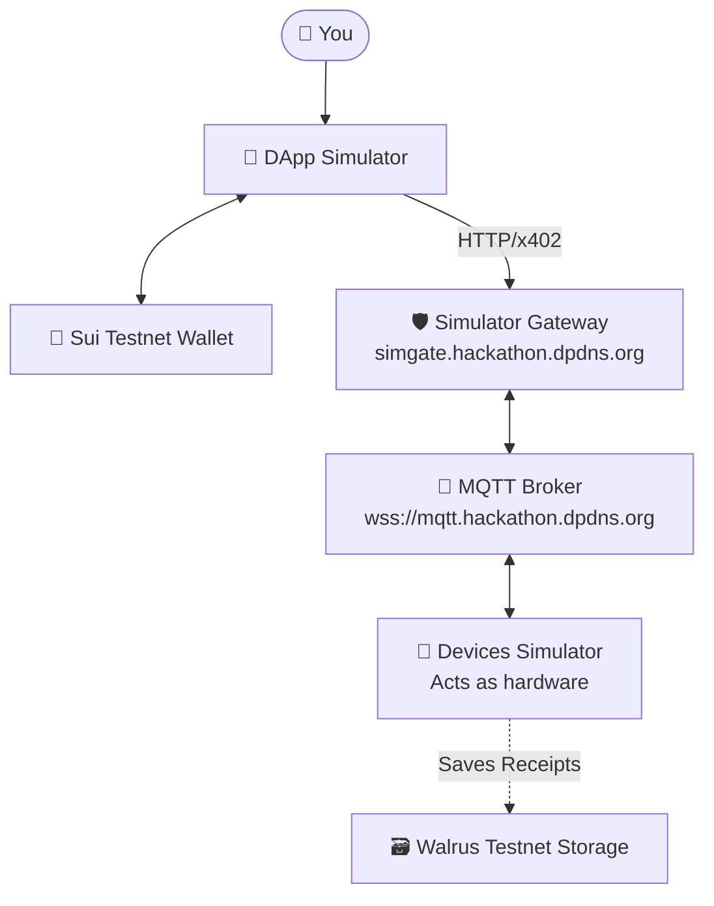
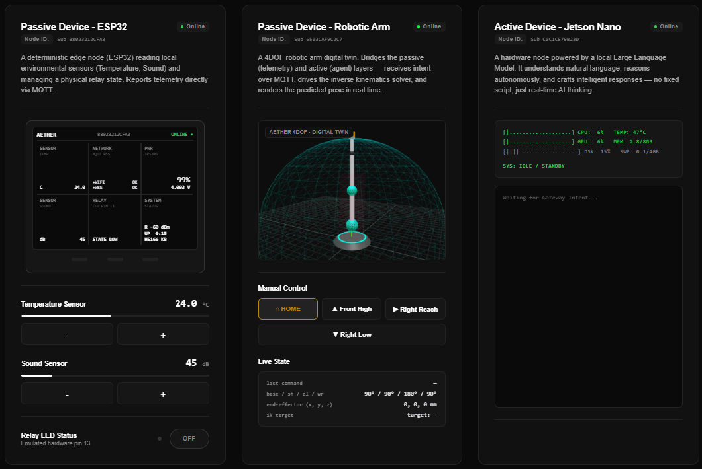

# 🖥️ Aether Simulators — Complete Usage Guide

<div align="center">
  
</div>

---

> This guide walks you through using the **two production-ready Aether simulators** deployed on **Sui Testnet**. No physical hardware is required. The simulators faithfully replicate the full Agentic IoT economy loop: wallet connection → x402 payment → MQTT command dispatch → hardware receipt → Walrus archive.

---

## ⚡ Quick Start (2 minutes)

| Step | What to do |
|---|---|
| 1 | Open the **[Devices Simulator](https://aether-devices-simulator.expo.app/)** in Tab 1 |
| 2 | Open the **[DApp Simulator](https://aether-dapp-simulator.expo.app/)** in Tab 2 |
| 3 | Install a Sui wallet browser extension (**[Slush](https://slush.app/) recommended**) |
| 4 | Get free Testnet SUI + USDC (faucet links below) |
| 5 | Connect your wallet in the DApp Simulator |
| 6 | Click any hardware button and sign the x402 transaction |

---

## 🗺️ Architecture Overview

When you use both simulators together, this is what actually happens behind the scenes:



The **Devices Simulator** connects to the same MQTT broker as the real hardware. When the DApp triggers a command, the Devices Simulator receives it, processes it, and returns a receipt — exactly like a physical device would.

---

## 🔧 Prerequisites

### 1. Install a Sui Wallet

You need a Sui-compatible browser extension wallet. The simulators are configured to only accept wallets with Sui features.

**Recommended wallets:**
- [Slush Wallet](https://slush.app/) — Chrome ⭐ **Recommended**
- [Suiet Wallet](https://suiet.app/) — Chrome/Firefox
- [Sui Wallet (official)](https://chrome.google.com/webstore/detail/sui-wallet/opcgpfmipidbgpenhmajoajpbobppdil) — Chrome

> After installing, create a new wallet and **write down your seed phrase safely**.

### 2. Switch to Testnet

In your wallet extension:
1. Open the wallet settings
2. Find **Network** or **RPC URL**
3. Select **Testnet** (or `https://fullnode.testnet.sui.io:443`)

### 3. Get Testnet SUI (Gas)

You need Testnet SUI to pay gas fees for transactions.

- **Sui Testnet Faucet**: Go to [faucet.testnet.sui.io](https://faucet.testnet.sui.io/) and request SUI
- **Alternative**: Join the [Sui Discord](https://discord.gg/sui) and use the `#devnet-faucet` channel with your address

### 4. Get Testnet USDC

Aether uses **USDC (Testnet)** as the payment token for x402 transactions. The token address is:
```
0xdba34672e30cb065b1f93e3ab55318768fd6fef66c15942c9f7cb846e2f900e7::usdc::USDC
```

**How to get Testnet USDC:**
1. Visit the [Sui Testnet Faucet](https://faucet.testnet.sui.io/)
2. Or use a testnet DEX swap to convert Testnet SUI → Testnet USDC

> 💡 Each hardware command costs between **1,000–3,000 USDC base units** (0.001–0.003 USDC). A small balance goes a long way.

---

## 📺 Tab 1 — Devices Simulator

**URL:** [https://aether-devices-simulator.expo.app/](https://aether-devices-simulator.expo.app/)

This application acts as your **virtual hardware rack**. It connects to the Aether MQTT broker and waits for commands from the DApp Simulator, exactly as real physical devices would.

<div align="center">
  
</div>
<div align="center">
  <i>*Fig 1. The Aether Devices Simulator Dashboard.*</i>
</div>

### Header Bar

<div align="center">
  
</div>
<div align="center">
  <i>*Fig 2. The streamlined global header featuring the Walrus Archive panel and Telemetry controls.*</i>
</div>

**Top-center — Walrus Testnet Archive panel:** Initially shows `AWAITING WALRUS TELEMETRY...`. After any successful command, it populates with:
- **`NODE`**: The device ID that executed the command (e.g. `Sub_B8023212CFA3`)
- **`BLOB`**: The full Walrus Blob ID — the immutable receipt hash (click to open in explorer)
- **`TIME`**: The timestamp of when the receipt was archived

**Top-right — `OPEN TELEMETRY` button:** Click to open a sliding drawer with all raw MQTT events in real time (subscriptions, publishes, receipts, Walrus uploads, errors).

---

### The Three Device Cards

<div align="center">
  
</div>
<div align="center">
  <i>*Fig 3. The three primary simulated node interfaces: Passive ESP32 (Left), 4DOF Robotic Arm (Center), and Active Jetson Nano (Right).*</i>
</div>

#### 🟡 Left Card — Passive Device (ESP32 Mock)
**Node ID:** `Sub_B8023212CFA3`

This card simulates an **M5Stack ESP32 IoT sensor node**. It features a digital readout display showing live simulated network and sensor metrics.

Below the device display, two interactive sliders let you manually set what the sensor will report when queried:
- **Temperature Sensor** — drag to set value (e.g. `24.0 °C`)
- **Sound Sensor** — drag to set noise level (e.g. `45 dB`)

When the DApp sends `READ_SENSORS`, the receipt will contain exactly the values you set here. When `ON`/`OFF` is sent, the **STATE** shown in the device display toggles between `HIGH` and `LOW`.

---

#### 🔵 Center Card — Passive Device (Robotic Arm Mock)
**Node ID:** `Sub_6503CAF9C2C7`

This card simulates a **4-DOF robotic arm digital twin**. The card description reads:
> *"A 4DOF robotic arm digital twin. Bridges the passive (telemetry) and active (agent) layers — receives intent over MQTT, drives the inverse kinematics solver, and renders the predicted pose in real time."*

The card displays a **live 3D wireframe visualization** of the arm (`AETHER 4DOF - DIGITAL TWIN`), rendered inside a hemispheric dome grid. The arm pose updates visually as commands arrive.

Below the 3D view you will find:
- **`MANUAL CONTROL`** section with buttons: `⌂ HOME`, `▲ Front High`, `▶ Right Reach`, `▼ Right Low` — these let you manually trigger arm poses directly from the simulator without going through the DApp
- **`LIVE STATE`** section — shows the last received command and current joint state

---

#### 🟢 Right Card — Active Device (Jetson Nano Mock)
**Node ID:** `Sub_C0C1CE79B23D`

This card simulates a **Jetson Nano AI edge node**. The card description reads:
> *"A hardware node powered by a local Large Language Model. It understands natural language, reasons autonomously, and crafts intelligent responses — no fixed script, just real-time AI thinking."*

The card displays a **live system terminal** showing dynamically animated hardware metrics (CPU, GPU, MEM, and TEMP). When the AI receives a prompt, these vitals visually spike into the amber and red zones, accompanied by an alert stating `SYS: ALLOCATING TENSORS FOR LOCAL INFERENCE`. When inactive, the vitals cool down and the system returns to `SYS: IDLE / STANDBY`.

Below the terminal there is a **chat panel** that starts with `Waiting for Gateway intent...`. When the DApp Agent sends a prompt to this node, the prompt and AI response appear here in real time — showing you exactly what the Jetson would process if it were real hardware.

---

### Telemetry Log

Click **`OPEN TELEMETRY`** in the top-right to open a full-width sliding drawer. It streams all raw MQTT events chronologically:
- Device subscriptions on boot
- Heartbeat publishes from each node
- Incoming action commands from the DApp
- Outgoing receipt publishes back to the gateway
- Walrus archive confirmations with `blobId`

<div align="center">
  
</div>
<div align="center">
  <i>*Fig 4. The real-time Telemetry & RPC log drawer sliding over the simulator dashboard, offering full visibility into the MQTT message lifecycle.*</i>
</div>

---

## 🎮 Tab 2 — DApp Simulator

**URL:** [https://aether-dapp-simulator.expo.app/](https://aether-dapp-simulator.expo.app/)

This is the **control interface**. It is where you connect your wallet and trigger x402-paid hardware commands. It has two operating modes: **Direct Control** and **Agent**.

### Step 1 — Connect Your Wallet

1. Click the **Connect** button in the top-right corner
2. Select your wallet from the list (only Sui-compatible wallets appear)
3. Approve the connection request in your wallet extension
4. Your wallet address will appear in the button

> ⚠️ If you see "Unlock or finish setting up your Sui wallet", your wallet is installed but locked. Open the extension and unlock it first.

---

## 🕹️ Direct Control Tab

Manual, deterministic control. You trigger a specific pre-defined command and sign an x402 payment directly.

### Passive Device Card

| Button | Command | Effect in Devices Simulator |
|---|---|---|
| **Read Sensors** | `READ_SENSORS` | Returns temperature + sound readings from the slider values you set |
| **LED ON** | `ON` | Turns the simulated LED on (green indicator lights up) |
| **LED OFF** | `OFF` | Turns the simulated LED off |

**How to use:**
1. Make sure your wallet is connected
2. Click **Read Sensors**
3. A Sui wallet popup will appear asking you to sign a transaction
4. Click **Approve** in your wallet
5. Watch the telemetry logs in both tabs update
6. A toast notification will appear with:
   - A link to view the transaction on **SUI Scan (Testnet)**
   - A link to view the receipt on **Walrus Testnet Explorer**

### Robotic Arm Card

| Button | Command | Description |
|---|---|---|
| **⌂ HOME** | `HOME` | Returns arm to the default neutral position |
| **Front High** | `MOVE1` | Moves arm forward and up |
| **Right Reach** | `MOVE2` | Extends arm to the right |
| **Right Low** | `MOVE3` | Lowers arm to the right side |

Each button triggers an x402 transaction — sign it in your wallet to dispatch the command.

### Active Node Card

A simple chat input. Type a natural language query and click **Send**.

1. Your prompt is sent (via x402) to the Jetson simulator
2. The simulator processes it through the deployed AI model
3. The response is displayed in the chat

> Example prompts: `"What is the weather in Tokyo?"`, `"Explain quantum computing in one paragraph"`, `"Say hello in French"`

---

## 🤖 Agent Tab

Fully autonomous AI orchestration. Instead of manually picking commands, you describe what you want in natural language and the **AWS Bedrock (Meta Llama 4 Maverick)** agent decides which hardware to invoke and in what sequence.

### How it works

1. Your message is sent to the Aether Orchestrator API
2. The LLM automatically calls `DISCOVER_SKILLS` to fetch the live hardware schema from the gateway
3. The LLM reasons about your request and emits one or more `tool_calls`
4. The DApp iterates through the tool calls, executing each as a separate x402 transaction
5. Each response is added to the chat

### Example prompts to try

```
"What devices do you have available?"
```
→ The agent will discover and describe all connected hardware (no transactions triggered)

```
"Read the current sensor data from the passive device"
```
→ Agent will trigger `READ_SENSORS` on the passive node (1 transaction to sign)

```
"Turn on the LED and then read the sensor"
```
→ Agent will sequence 2 tool calls: `ON` then `READ_SENSORS` (2 transactions to sign)

```
"Move the robotic arm home"
```
→ Agent will trigger `ARM_HOME` on the robotic arm simulator (1 transaction to sign)

```
"Ask the active node what the capital of France is"
```
→ Agent routes the prompt to the Jetson AI simulator

> **Note**: For each tool call the agent generates, you will need to sign a wallet transaction. Multi-step commands require multiple signatures.

---

## 📋 The Complete Transaction Lifecycle

When you trigger a manual action or the AI agent orchestrates a tool call, the following end-to-end lifecycle executes. Thanks to Sui's sub-second finality and the Aether Gateway's automated x402 negotiation, this entire process occurs autonomously within **2 to 4 seconds**, requiring zero human intervention:

```
1.  DApp builds the petition payload:
    { tx_id, requester, target_hardware_id, command, ... }

2.  DApp sends POST to:
    https://simgate.hackathon.dpdns.org/aether/hire

3.  Gateway responds: HTTP 402 Payment Required
    (includes x402-payment-requirement header with USDC price)

4.  ExactSuiDappScheme builds a Programmable Transaction Block (PTB)
    to transfer USDC from your wallet to the gateway's wallet

5.  Your Sui wallet extension shows a signing popup

6.  You click Approve → PTB is co-signed by the facilitator

7.  DApp resubmits with x402-payment-payload header

8.  Gateway verifies payment → Sui Testnet transaction confirmed

9.  Gateway publishes MQTT command to:
    aether/passive/{device_id}/action  (for passive)
    aether/active/{device_id}/intent   (for active)

10. Devices Simulator receives the MQTT message

11. Devices Simulator processes the command, updates UI

12. Devices Simulator publishes receipt to:
    aether/passive/{device_id}/receipt (for passive)
    aether/active/{device_id}/receipt  (for active)

13. Gateway receives receipt, uploads telemetry to Walrus Testnet

14. Gateway returns HTTP 200 to DApp with:
    { transaction: "0x...", receipt: {...}, walrus_blob_id: "..." }

15. DApp shows success toast with SUI Scan + Walrus links
```

---

## 🔍 Verifying Your Transactions

Every successful hardware command instantly generates a toast notification containing direct links to two verifiable on-chain artifacts.

<div align="center">
  
</div>
<div align="center">
  <i>*Fig 5. The success toast generated by the DApp Simulator upon a completed hardware actuation.*</i>
</div>

### 1. SUI Scan (Testnet)
Click **"View on SUI Explorer"** in the toast to view the full on-chain record of the x402 USDC micro-transaction transferred from your wallet to the Aether Gateway. You can also manually navigate to:
```text
https://suiscan.xyz/testnet/tx/{your_transaction_hash}
```

### 2. Walrus Testnet Explorer
Click **"Open Walrus Explorer"** in the toast to view the raw JSON telemetry receipt generated by the hardware. This data is permanently anchored to the Walrus decentralized storage network.

<div align="center">
  
</div>
<div align="center">
  <i>*Fig 6. The hardware simulator receives the Blob ID confirmation from the Gateway in real-time.*</i>
</div>

<div align="center">
  
</div>
<div align="center">
  <i>*Fig 7. The Walrus Explorer displays the immutable JSON receipt payload.*</i>
</div>

---

## 🛠️ Troubleshooting

| Problem | Likely Cause | Solution |
|---|---|---|
| Devices Simulator dots stay red | MQTT broker unreachable | Refresh the page. Check your network/firewall. |
| "Wallet not connected" error | Wallet disconnected | Click Connect and reconnect your wallet |
| Transaction popup never appears | Wallet extension blocked by browser | Allow popups for the domain in browser settings |
| "User rejected" error | You declined the signature | Click the action button again and click Approve |
| "402 Payment Required" stuck | Insufficient USDC balance | Get more Testnet USDC from the faucet |
| Devices Simulator shows no receipt | MQTT round-trip timeout | Refresh both tabs and retry; the broker occasionally resets |
| Agent says "Gateway unavailable" | Simulator gateway is offline | Check `https://simgate.hackathon.dpdns.org/aether/health` |


---

## 🌐 Live Infrastructure — Open in Your Browser

All services below are **deployed and live right now**. You can open each URL directly in your browser to verify the system is running.

### 🛡️ Simulator Gateway (`simgate.hackathon.dpdns.org`)

The Aether Gateway Simulator is the x402 enforcement layer for the Testnet environment. It is connected to **3 supervised simulated devices** via the MQTT broker.

| Endpoint | URL | What it returns |
|---|---|---|
| **Health** | [simgate.hackathon.dpdns.org/aether/health](https://simgate.hackathon.dpdns.org/aether/health) | `{ok, gateway_address, uptime}` — confirms the server is online |
| **Status** | [simgate.hackathon.dpdns.org/aether/status](https://simgate.hackathon.dpdns.org/aether/status) | Full subsystem snapshot: broker connection, supervised devices count, in-flight requests |
| **Agent Guide** | [simgate.hackathon.dpdns.org/aether/agent-guide.json](https://simgate.hackathon.dpdns.org/aether/agent-guide.json) | Live LLM-readable schema: all registered devices, capabilities, commands, and x402 pricing |

**Example `/aether/status` response:**
```json
{
  "ok": true,
  "gateway": "0x4fd0bb1b499dd9a00b757a26cf3a49ea0cf207e4732d9901e70f94a76cffe4de",
  "uptime": 26139,
  "broker": {
    "connected": true,
    "broker": "wss://mqtt.hackathon.dpdns.org:443",
    "gatewayId": "Gateway_Victor",
    "supervised": 3
  },
  "inflight": 0
}
```

**Example `/aether/agent-guide.json` response (abbreviated):**
```json
{
  "ok": true,
  "system_description": "Aether Gateway Simulator - Exposes simulated machine capabilities through x402 over HTTP.",
  "agent_routing_instructions": [
    "If the user refers to a 'passive node' or physical device, select a hardware target with type 'PASSIVE'.",
    "If the user refers to the 'active node', select a hardware target with type 'ACTIVE'."
  ],
  "hardware_targets": [
    { "id": "Sub_B8023212CFA3", "name": "M5Stack Passive Node", "type": "PASSIVE", "..." },
    { "id": "Sub_C0C1CE79B23D", "name": "Jetson Nano AI Node",  "type": "ACTIVE",  "..." },
    { "id": "Sub_6503CAF9C2C7", "name": "Robotic Arm",          "type": "PASSIVE", "..." }
  ]
}
```

---

### ⛽ Sui Facilitator (`sui.hackathon.dpdns.org`)

The Facilitator is the **gas sponsorship service** — it co-signs every x402 Programmable Transaction Block so users pay zero SUI gas. It runs on Sui **Testnet**.

| Endpoint | URL | What it returns |
|---|---|---|
| **Health** | [sui.hackathon.dpdns.org/health](https://sui.hackathon.dpdns.org/health) | `{"status": "ok"}` — confirms the facilitator is live |
| **Sponsor** | `POST sui.hackathon.dpdns.org/sponsor` | Accepts an unsigned PTB and returns it co-signed with the facilitator keypair |
| **Verify** | `POST sui.hackathon.dpdns.org/verify` | Validates a submitted x402 payment payload |
| **Settle** | `POST sui.hackathon.dpdns.org/settle` | Executes final on-chain settlement on Sui Testnet |

> The `/sponsor`, `/verify`, and `/settle` endpoints are called automatically by the DApp Simulator during every x402 transaction. You do not need to call them manually.

---

## 🔧 Full Service Reference

| Service | URL | Network |
|---|---|---|
| DApp Simulator | [aether-dapp-simulator.expo.app](https://aether-dapp-simulator.expo.app/) | Testnet |
| Devices Simulator | [aether-devices-simulator.expo.app](https://aether-devices-simulator.expo.app/) | Testnet |
| Gateway Health | [simgate.hackathon.dpdns.org/aether/health](https://simgate.hackathon.dpdns.org/aether/health) | Testnet |
| Gateway Status | [simgate.hackathon.dpdns.org/aether/status](https://simgate.hackathon.dpdns.org/aether/status) | Testnet |
| Agent Guide (Live Schema) | [simgate.hackathon.dpdns.org/aether/agent-guide.json](https://simgate.hackathon.dpdns.org/aether/agent-guide.json) | Testnet |
| Facilitator Health | [sui.hackathon.dpdns.org/health](https://sui.hackathon.dpdns.org/health) | Testnet |
| MQTT Broker | `wss://mqtt.hackathon.dpdns.org:443` | Testnet |
| SUI Scan (Testnet) | [suiscan.xyz/testnet](https://suiscan.xyz/testnet) | Testnet |
| Walrus Explorer | [aggregator.walrus-testnet.walrus.space](https://aggregator.walrus-testnet.walrus.space) | Testnet |

---

<div align="center">
  <i>Both simulators are production-grade Expo applications deployed via EAS on Sui Testnet.</i><br/>
  <i>No physical hardware required. All transactions are real and on-chain.</i>
</div>

